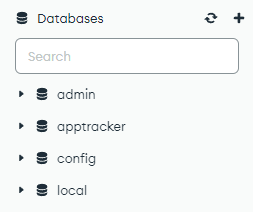
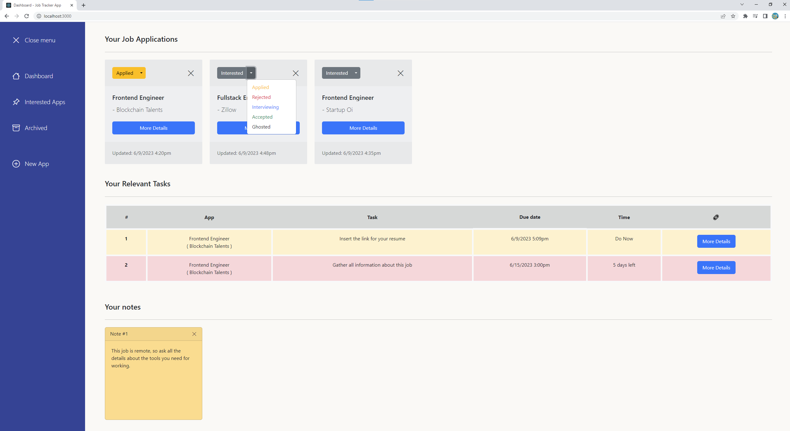
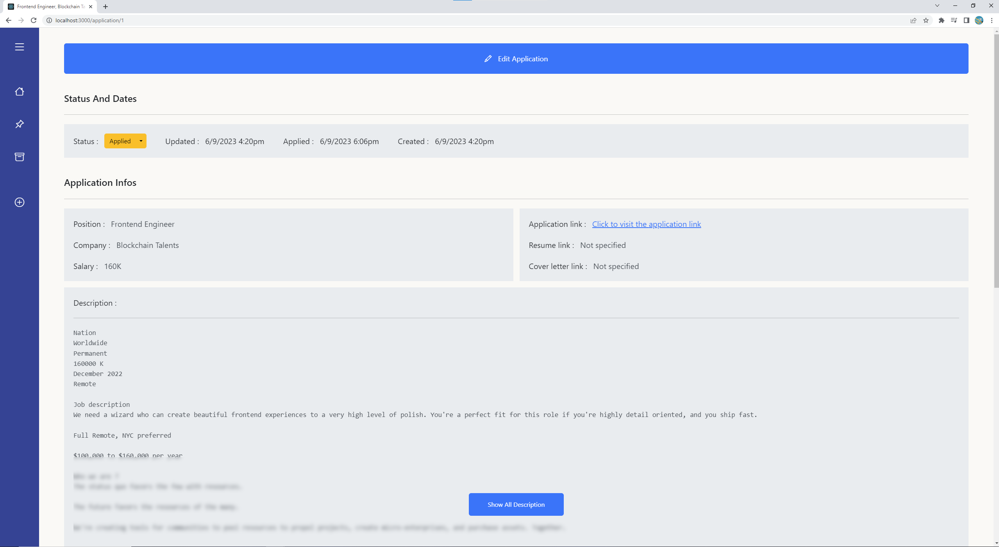
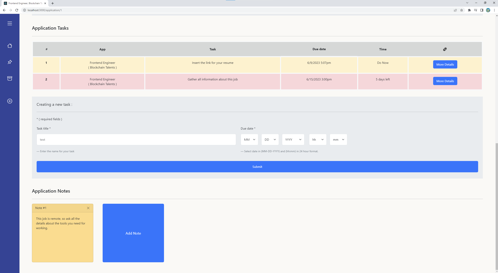
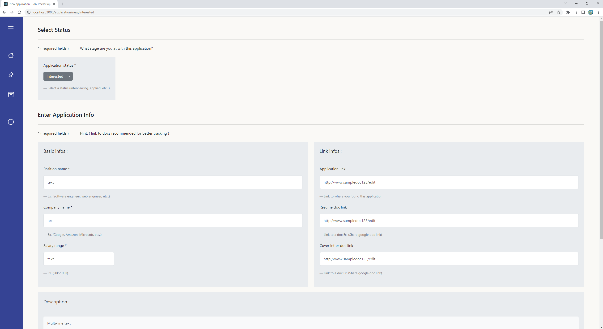
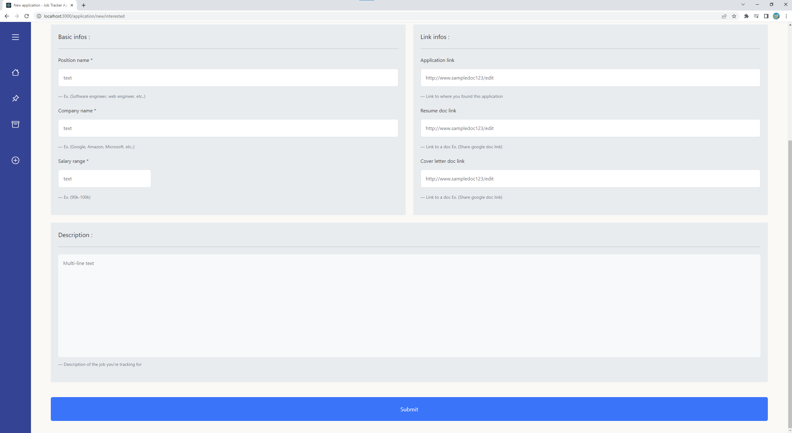
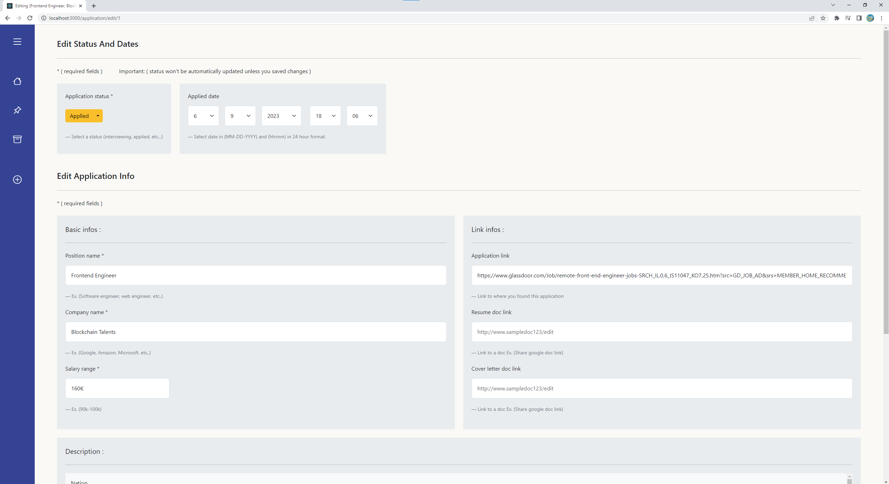
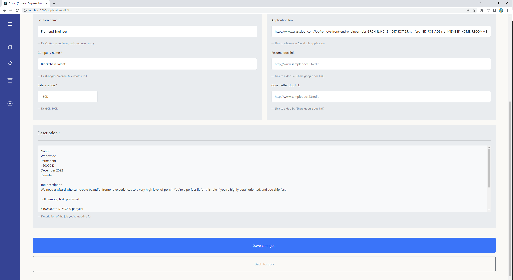
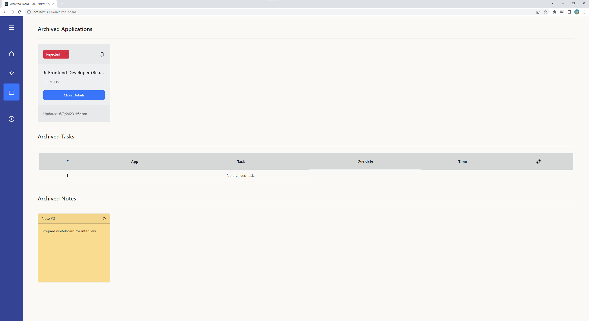
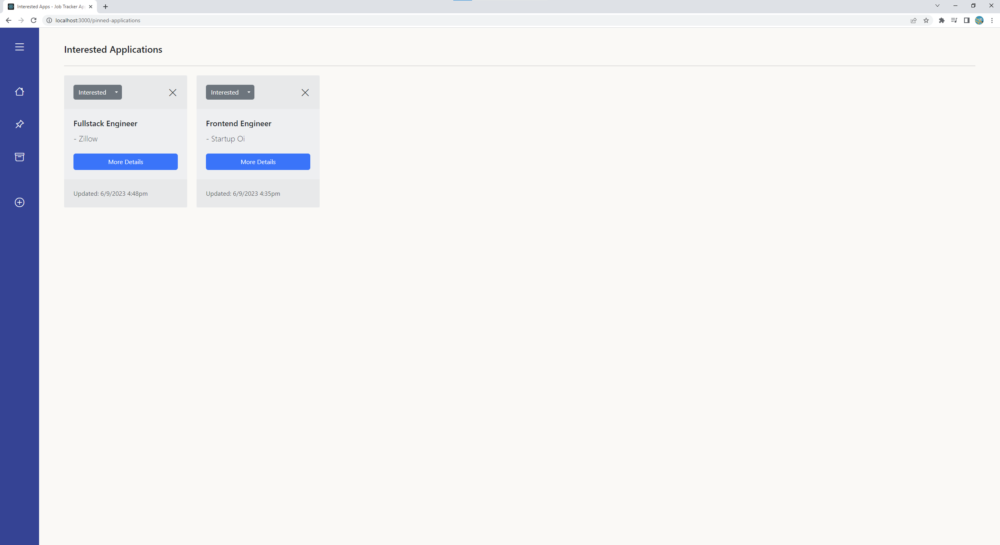

# Job-Application-Tracker-App

Job tracker app is a tool that helps manage all job applications in one place. It simplifies the process of keeping track of the companies and positions you've applied to, as well as the status of each application. You can also use the app to manage tasks and take notes for each job application, making it easier to follow up with employers and future interviews. 

**The time used in this app is based off your computer's local time.**

# Technologies Used

- Backend: Django, Djongo, MongoDB, Django REST Framework
- Frontend: React.js, HTML, CSS (Bootstrap), Axios

# Designs

This application was designed using figma. From initial sketches to prototypes.

https://www.figma.com/file/jXAmFzBf4VQl7PFGGbISVQ/Job-Tracker-Application?type=design&node-id=0%3A1&t=feJ8UCNlgcwfnnh4-1

# Contributors
- Kelvin Chan (Github: chan34kelvin)
- Damon Chen (Github: pterofighter)

# Installation
The following instructions will help you setup this application to run in the local machine.

## Prerequisites
Have these installed before approaching the next steps.
- Have mongoDB community server installed on your computer.

For windows, install here: https://www.mongodb.com/try/download/community-kubernetes-operator

For mac, follow this doc: https://docs.google.com/document/d/1QfQ5nFLKqnzoVeREdH5JEA9NjsbkRwo8V_EMeXvc7fY/edit?usp=sharing

- Have mongoDBCompass installed on your computer.
- Have python 3.9.7 or up, use ```python --version``` command to check inside the terminal.

If you have older versions of python, just uninstall it from your computer in settings and reinstall the newer version online.

- Have Visual Studio Code installed.

## Cloning From Repo
Open "Code" button and select clone url in HTTPS or SSH, copy the url.
- Open your terminal to a desired directory and type ```git clone "copied url"```
After you finish entering your github credentials, the folder should be created inside the directory.
- Open Visual Studio Code and open the apptracker project.
- Open terminal, make a split terminal with git bash and make sure both terminals are in apptracker directory.

Do ```cd apptracker``` if you're not inside that directory for the terminals.

Stay inside apptracker directory, this is where we install the appropriate tools.

## Tools Setup
- ```pip install pipenv``` to install the virtual environment for backend.
- ```python -m pipenv shell``` to activate the virtual environment.
- Use the following installation commands inside the environment.  
```
pipenv sync
pip install djongo
pip install --force-reinstall -v "Pymongo==3.12.3"
```
- Do command ```pip list``` to check the following tool versions
```
Package             Version
------------------- --------
asgiref             3.7.0
certifi             2023.5.7
distlib             0.3.6
Django              4.1.9
django-cors-headers 4.0.0
djangorestframework 3.14.0
djongo              1.3.6
dnspython           2.3.0
filelock            3.12.0
pip                 23.1.2
pipenv              2023.6.2
platformdirs        3.5.1
pymongo             3.12.3
pytz                2023.3
setuptools          67.7.2
sqlparse            0.2.4
tzdata              2023.3
virtualenv          20.23.0
virtualenv-clone    0.5.7
wheel               0.40.0
```
Everything doesn't have to be exact versions except,
- sqlparse = 0.2.4
- pymongo = 3.12.3

If these two aren't in the exact version, use these commands, **else skip these.**
```
pip install --force-reinstall -v "Pymongo==3.12.3"
pip install --force-reinstall -v "Sqlparse==0.2.4"
```

## Database Setup And Migrations
- Use ```cd backend``` to enter the backend directory.

### Step 1:
- Use these commands to finish setting up/migrating.
```
python -m manage makemigrations trackerapp
python -m manage migrate trackerapp
```
### Step 2:
- Open mongoDBCompass app.
- Connect into localhost 27017.
- Refresh the database and check if apptracker is created.



### Step 3:
- Start the backend.
- **Skip step 4 if you're newly setting up.**

### Step 4: Only For Replacing Old Db With New Db
This is to clean up an existing database. Skip this if you're newly setting up the database.
- Go to mongoDBCompass app and connect to localhost 27017.
- Find apptracker database then drop it by clciking the trashbin icon.
- Go to migration folder inside backend/trackerapp folder and delete 0.0001 py
- Repeat steps from 1 to 3.

## Starting Backend
- Skip step 1 if your environment is already activated. If unsure, just do step 1.

### Step 1:
- If virtual environment not activiated, do ```python -m pipenv shell``` in the main github folder.

### Step 2:
- Use ```pip list``` and check to make sure it matches the pip list reqs. above.
- ```cd backend``` to enter the backend directory.

### Step 3:
- ```python -m manage runserver``` to start it inside the backend directory.

Backend should be running if there isn't any errors showing up, **now start the frontend in the other split terminal.**

## Starting Frontend
- Skip to step 2 if you already ```npm install```. Don't skip if you're newly setting up.

### Step 1:
- Go to frontend folder, if you're in backend folder, do ```cd ..``` to backtrack into parent directory.
- From github main folder, do ```cd frontend``` to enter frontend directory.
- Install the tools for frontend with ```npm install```
- do ```npm ls``` and check if your list matches with this.
```
├── @testing-library/jest-dom@5.16.5
├── @testing-library/react@13.4.0
├── @testing-library/user-event@13.5.0
├── axios@1.4.0
├── bootstrap-icons@1.10.5
├── bootstrap@5.3.0-alpha3
├── moment-timezone@0.5.43
├── moment@2.29.4
├── react-dom@18.2.0
├── react-router-dom@6.10.0
├── react-scripts@5.0.1
├── react@18.2.0
└── web-vitals@2.1.4
```
- If it matches, proceed to Step 2, else do the commands below.
- In case the tools didn't successfully install, here is the list of tools used in frontend. Don't use this if ```npm install``` run successfully.
```
npm install bootstrap@5.3.0-alpha3
npm i react-router-dom
npm install moment 
npm i bootstrap-icons
npm install moment-timezone --save
```
### Step 2:
- Make sure you're in frontend directory.
- Start the frontend using ```npm start```
If a page pops up without errors, frontend is loaded successfully.

After you did a ```npm install``` once, you can start from step 2 and skip step 1 to start the frontend.

# Project Snapshots

## Dashboard


## Application



## New Application



## Edit Application



## Archived Board
- A restore button to restore this application or notes from archived.



## Interested Applications


# Resources

Image: Css Basic Miscellany Flat icon  
Author: Freepik  
Source: Freepik (URL: https://www.freepik.com/icon/css_302423#fromView=search&term=list&page=1&position=81)  