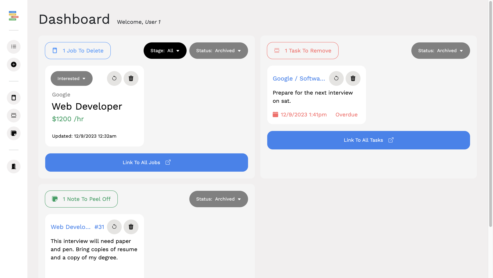
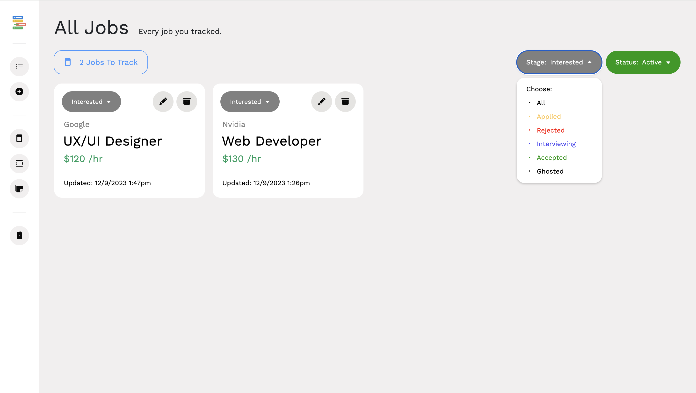
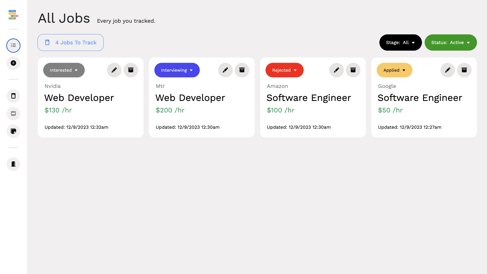
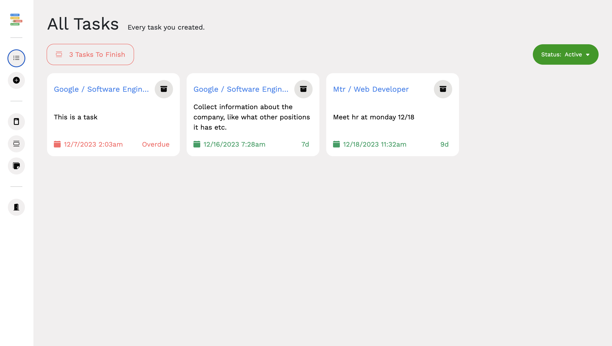
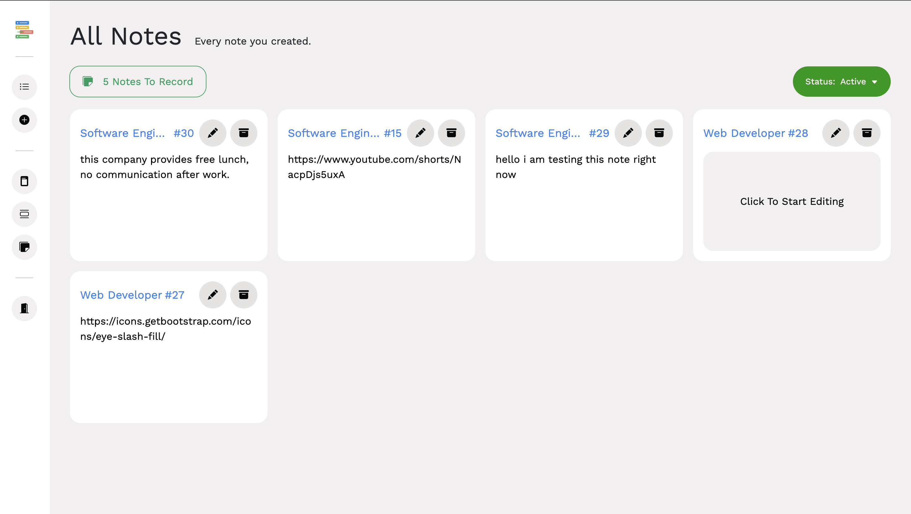

# Job-Application-Tracker-App v2.0

Job tracker app is a tool that helps manage all job applications in one place. It simplifies the process of keeping track of the companies and positions you've applied to, as well as the status of each application. You can also use the app to manage tasks and take notes for each job application, making it easier to follow up with employers and future interviews. 

**The time used in this app is based off your computer's local time.**

## What's New and Different Compared to v1.0?
Check out v2.0 Notes & Patches below:
https://docs.google.com/document/d/1gkx_9STR1gbXEw31rTgKh1j8LjoQFzjNdoMKOIzA66g/edit?usp=sharing

# Technologies Used
- Backend: Django, Djongo, MongoDB, Django REST Framework
- Frontend: React.js, HTML, CSS (Bootstrap), Axios

# Development Documentation
- Development Docs:
https://docs.google.com/document/d/1A4i4dL2hSM_ZcLYZXczjuIID0aVfLw3OKZj_1x2ra-o/edit?usp=sharing

# Contributors
- Kelvin Chan (Github: chan34kelvin)
- Damon Chen (Github: pterofighter)

# Installation
Follow this link for instructions on how to install and use this application:
https://docs.google.com/document/d/1iIqQoPxdEsYk8TVBMIBDvzLAHp3-g6rDB-FnzstRuf8/edit?usp=sharing

# Project Snapshots

Here are some snapshots of how the application looks:

## Dashboard
.png)
.png)

## Application
.png)
.png)

## New Application
.png)
.png)

## Edit Application
.png)
.png)

## Archived Board
- With a simple filter change in status, you can restore or delete any tasks, notes, and applications that you archived.
- This ensures users don't accidentally delete anything by accident and have a chance to restore it. (Like Recycle Bin)

## Sorting Applications
- You can also sort apps by any stage and status of your choice.

## Page For All Jobs, Tasks, and Notes

# Resources

Image: Css Basic Miscellany Flat icon  
Author: Freepik  
Source: Freepik (URL: https://www.freepik.com/icon/css_302423#fromView=search&term=list&page=1&position=81)  