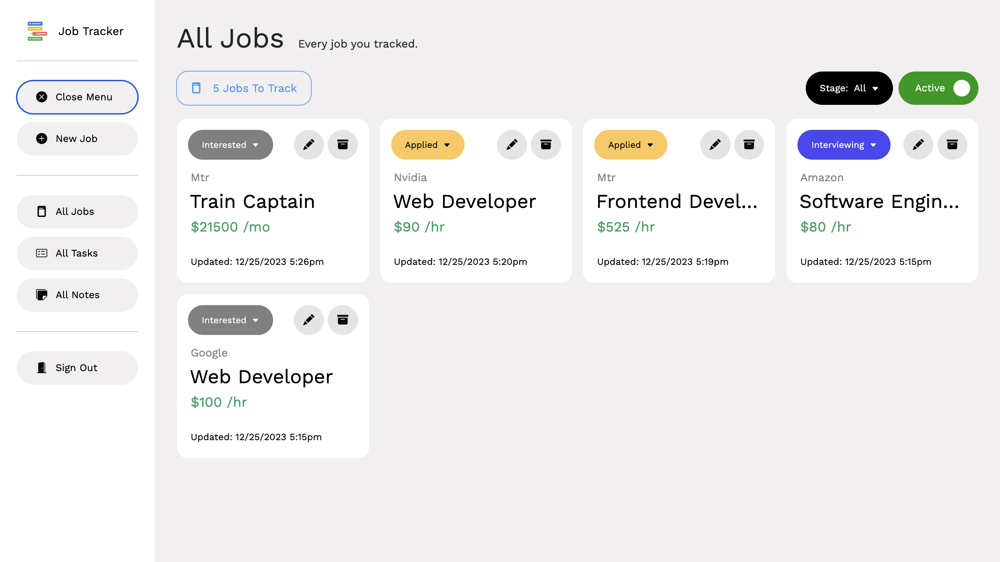
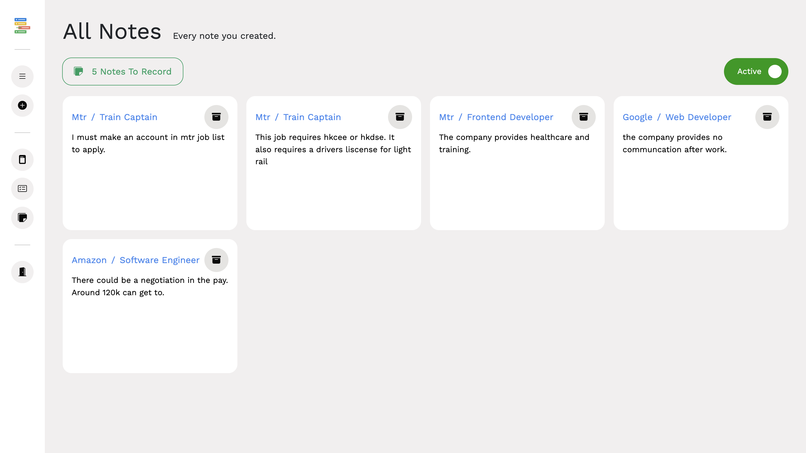

# Job-Application-Tracker-App v2.0

Job tracker app is a tool that helps manage all job applications in one place. It simplifies the process of keeping track of the companies and positions you've applied to, as well as the status of each application. You can also use the app to manage tasks and take notes for each job application, making it easier to follow up with employers and future interviews. 

**This is an app made responsive for both Mobile & Destop, there are some project snapshots below showing how it looks.**
**The time used in this app is based off your computer's local time.**

## What's New and Different Compared to v1.0?
Check out v2.0 Notes & Patches below:
https://docs.google.com/document/d/1gkx_9STR1gbXEw31rTgKh1j8LjoQFzjNdoMKOIzA66g/edit?usp=sharing

# Installation
Follow this link for instructions on how to install and use this application:
https://docs.google.com/document/d/1iIqQoPxdEsYk8TVBMIBDvzLAHp3-g6rDB-FnzstRuf8/edit?usp=sharing

# Contributors
- Kelvin Chan (Github: chan34kelvin)
- Damon Chen (Github: pterofighter)

# Frameworks Use
- Backend: Django, Djongo, MongoDB, Django REST Framework
- Frontend: React.js, Bootstrap Icons, Axios

# Programming Languages Use
- Backend: Python
- Frontend: Javascript, HTML5, CSS3

# Tools Use
- Version Control: Github
- Design & Mockups: Figma
- API Testing: Postman

# UI Mockups
- Here's the link of our Figma used for UI Mockups
https://www.figma.com/file/jXAmFzBf4VQl7PFGGbISVQ/Job-Tracker-Application?type=design&node-id=0%3A1&t=feJ8UCNlgcwfnnh4-1

# Full Documentation
- Development Docs:
https://docs.google.com/document/d/1A4i4dL2hSM_ZcLYZXczjuIID0aVfLw3OKZj_1x2ra-o/edit?usp=sharing

# Project Snapshots

Here are some snapshots of how the application looks both in Mobile & Desktop:

## Dashboard
- A preview of all jobs, tasks and notes.

.png)
.png)

## Application
- Shows all the important information of the job and its assoicated tasks and notes.

.png)
.png)

- When you archived the job itself, everything else associated (Tasks & Notes) gets archived as well.

.png)
.png)

- Mobile version

.png)
.png)
.png)
.png)

## Tracking New Application
- Users only have to fill out 3 important information (Ex: Job title, Company & Paid) to track a job.
- Easy and simple. 

.png)
.png)

- Mobile version

## Edit Application
- Can edit the information on the application easily in the style of a form.

.png)
.png)

- Mobile version

.png)
.png)

## Archived Board
- With a simple filter change in status, you can restore or delete any tasks, notes, and applications that you archived.
- This ensures users don't accidentally delete anything by accident and have a chance to restore it. (Like Recycle Bin)

.png)

## Sorting Applications
- You can also sort apps by any stage and status of your choice.
- Ex: (Interested) Stage

.png)

## Page For All Jobs, Tasks, and Notes
- You can check out all the notes, jobs, and tasks in one place and sort them by your desire.

- Mobile version of the board (Same layout with tasks & notes)

.png)
.png)

# Resources

Image: Css Basic Miscellany Flat icon  
Author: Freepik  
Source: Freepik (URL: https://www.freepik.com/icon/css_302423#fromView=search&term=list&page=1&position=81)  